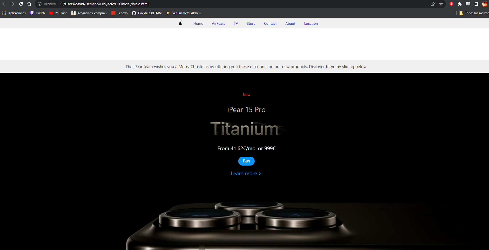
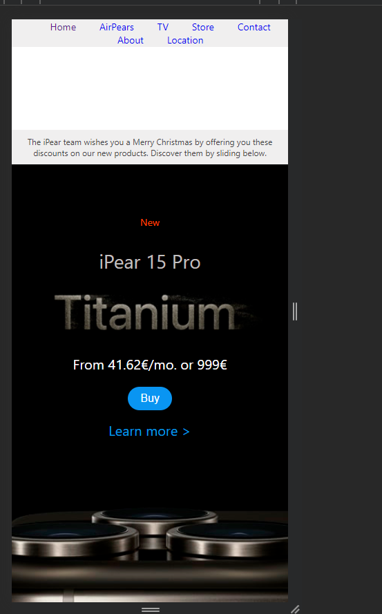
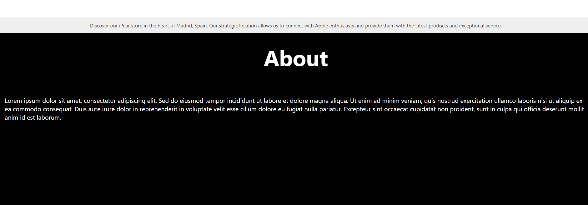
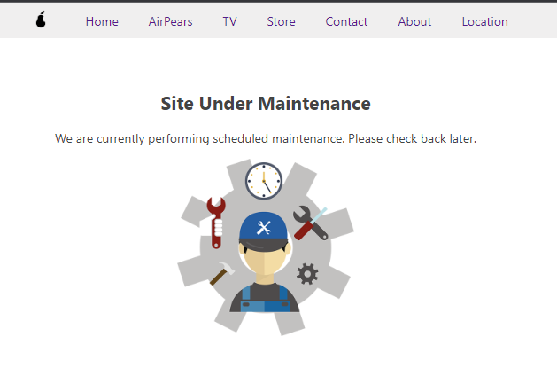

# Estructura de carpetas 

- Multimedia
- about.html
- estilos.css
- inicio.html
- location.html
- maintenance.html
- README.md

En esta estructura , el css no se encuentra en una carpeta por separado debido a que solo hay un archivo , y me daba problemas de compatibilidad, mientras en la carpeta de multimedia estan todas las imagenes, y los html dentro de la carpeta raíz.

# Tecnologías 

Las tecnologías que he utilizado para esta página que se diferencian de otras comunes aprendidas en clase , diria con son el @media only para estilizar clases para el dispostivo modil de x tamaño , además de utilizar el iframe para insertar el mapa dentro de la página de location.

# Características 

Las características que conforman esta página no son nada fuera del otro mundo , sino que se trata de una página web principal vendiendote el nuevo teléfono (producto) de iPear , y tienes una barra de navegación con muchos enlaces que te llevaran a la página de mantenimiento , esto se debe a que a falta de tiempo para realizar todos los enlaces he decidido hacer solo 3 páginas. Cada una de las páginas tiene responsive muy bien diseñado para que se mantenga la estética general de la página web con un diseño minimalista.

- Pasar el ratón por encima de enlaces para que cambien de color
- Diseño responsive en todas las página
- Estética y colores adaptados a 2023
- Imagenes escalables y con editadas.

# Imagenes de partes importantes de la página

